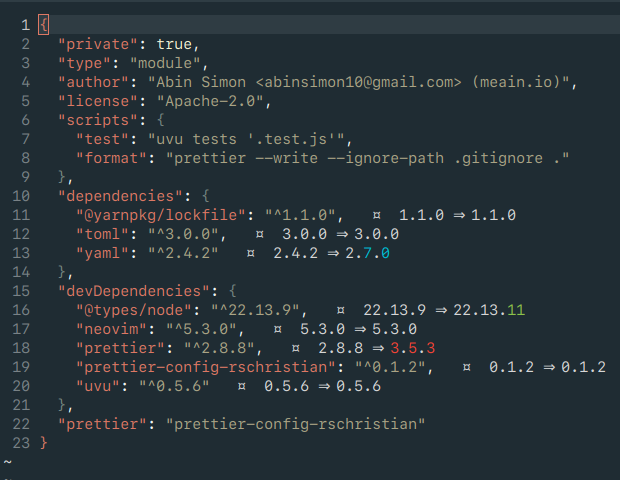

# vim-package-info 

Provides an easy way to see the latest versions of the packages you depend on.



**Currently supports:**

-   javascript:
    -   `package.json`
-   rust:
    -   `Cargo.toml`
-   python:
    -   `requirements.txt`
    -   `Pipfile`
    -   `pyproject.toml`

Default colors:

-   `green`: patch update
-   `cyan`: minor update
-   `red`: major update

## Installation

> Make sure you have node support for neovim.
> Run the command `npm install -g neovim` to add it. [#20](https://github.com/meain/vim-package-info/issues/20)

Use your favorite plugin manager to install the plugin.
I use [vim-plug](https://github.com/junegunn/vim-plug).

```vim
Plug('rschristian/vim-package-info', {['do'] = 'npm install --omit=dev'})
```

After installing the plugin, run `:UpdateRemotePlugins` to register it with Neovim.

---

Needs virtual text support. ( Neovim 0.3.2 )

> Check if `echo has('nvim-0.3.2')` returns 1

## Configuration

#### Change prefix

```
let g:vim_package_info_virtualtext_prefix = '  ¤ '
```

### Change highlight group

```
let g:vim_package_info_virtualtext_highlight = 'NonText'
```

There are three other highlight groups that you can change.
You can change them like this

```
hi VimPackageInfoPatch guifg=#8BC34A
hi VimPackageInfoMinor guifg=#00BCD4
hi VimPackageInfoMajor guifg=#F44336
```

## Possible issues

The plugin might conflict with [ALE](https://github.com/w0rp/ale) or any other plugins that use `virtualtext`.
This is because `virtualtext` context is the same for all the plugins and if one clears the `virtualtext`
it will clear the `virtualtext` that was made by all plugins.

Not a lot can be done about this, but in the case of ALE you can checkout [#14](https://github.com/meain/vim-package-info/issues/14).

## Alternatives

Other options for you to checkout if this does not work for you

-   [akinsho/dependency-assist.nvim](https://github.com/akinsho/dependency-assist.nvim)
-   [vuki656/package-info.nvim](https://github.com/vuki656/package-info.nvim)
-   [mhinz/vim-crates](https://github.com/mhinz/vim-crates)
